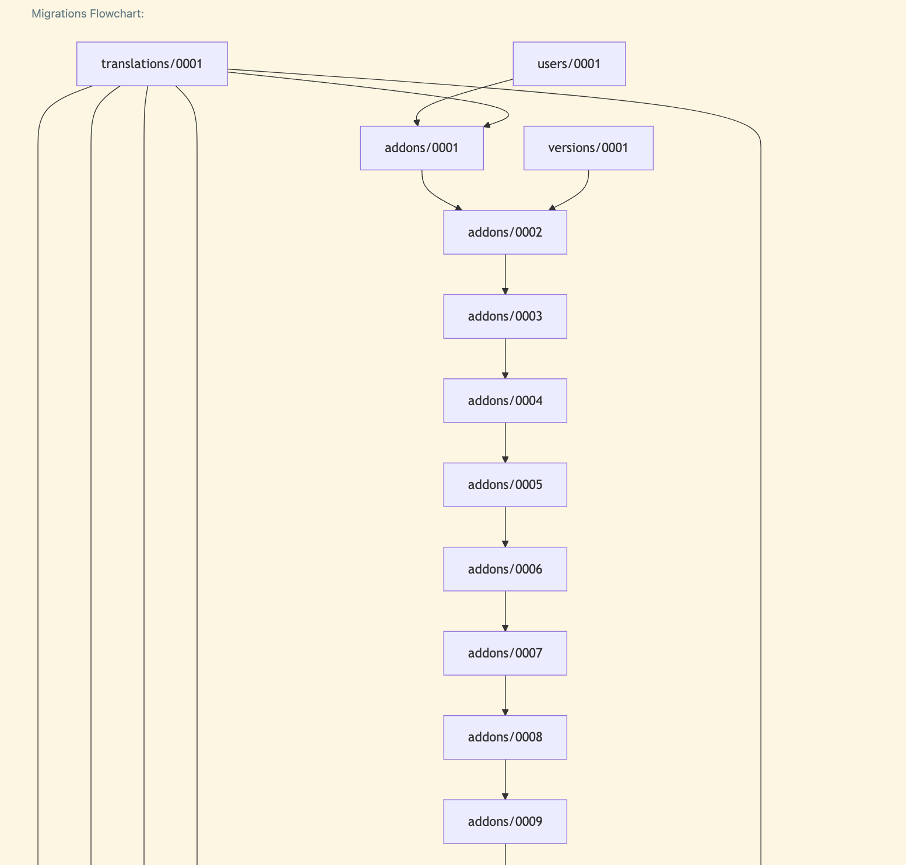

# Data Management

Effective data management is crucial for the **addons-server** project. This section focuses on how the project handles persistent data, data snapshots, and initial data population.

## Persistent Data Volumes

The project uses persistent data volumes to store MySQL data. This ensures that data remains intact even when containers are stopped or removed. For details on how these volumes are defined, refer to the Docker Compose configuration in the repository.

## External Mounts

The use of an external mount allows for manual management of the data lifecycle. This ensures that data is preserved even if you run `make down`. By defining the MySQL data volume as external, it decouples the data lifecycle from the container lifecycle, allowing you to manually manage the data.

## Data Initialization

When you run `make up` make will run the `initialize` command for you. This command will check if the database exists, and if the elasticsearch index exists.

If they don't exist it will create them. This command can be run manually as well.

```sh
make initialize
```

This command is responsible for ensuring your local mysql database is migrated, seeded, loaded with data and indexed.
There are a number of different ways to execute this command. In most cases, the default behavior is what you want.
But there are a few additional edge cases that it supports.

### Clean the database

  ```sh
  make initialize INIT_CLEAN=true
  ```

  This will force the database to be recreated, and re-initialized.

### Load a data backup

  ```sh
  make initialize [INIT_LOAD=<backup_name>]
  ```

  This command will load a data backup from a specified path. The optional `INIT_LOAD` argument allows you to
  specify the path to the data backup file. If not specified, the initialize command will determine if
  data should be loaded based on the current state of the databse, and will load the `_init` data backup.

### Skip seeding

```sh
make initialize INIT_SKIP_SEED=true
```

This will skip the seeding of the database. This can be useful in CI or if you specifically
want to avoid touching the previous data or creating a new _init backup.

### Skip index recreation

```sh
make initialize INIT_SKIP_INDEX=true
```

This will skip the recreation of the elasticsearch index. This can be useful in CI or if you specifically
want to avoid touching the previous elasticsearch index.

> NOTE: if your database is modified significantly and you don't re-index elasticsearch you could end up with
> a broken addons-frontend.

## Data seeding

`addons-server` uses a a data seeding mechanism to populate the database with the initial data. This data is used to
bootstrap the database with addons and other data to enable development.

The data seed is treted just like a data backup with a special name `_init`. To recreate the dataseed run:

```sh
make seed_data
```

This will flush the current database, remove the _init backup directory if it exists, run the seed commands,
and finally dump the data back into the _init backup directory.

The _init backup is used to populate the database with initial data during the initialization process.

## Data backups

You can export and load data snapshots to manage data states across different environments or for backup purposes.
The Makefile provides commands to facilitate this.
These commands rely internally on [django-dbbackup](https://django-dbbackup.readthedocs.io/en/stable/)

- **Data dump**:

  ```sh
  make data_dump [ARGS="--name <name> --force"]
  ```

  This command creates a dump of the current MySQL database. The command accepts an optional `name` argument which will determine
  the name of the directory created in the backup directory. By default it uses a timestamp to ensure uniqueness.

  You can also specify the `--force` argument to overwrite an existing backup with the same name.

- **Loading Data**:

  ```sh
  make data_load [ARGS="--name <name>"]
  ```

  This command will load data from an existing backup directory, synchronize the storage directory and reindex elasticsearch.
  The name is required and must match a directory in the backup directory.

## Hard Reset Database

The actual mysql database is created and managed by the `mysqld` container. The database is created on container start
and the actual data is stored in a persistent data volume. This enables data to persist across container restarts.

`addons-server` assumes that a database named `olympia` already exists and most data management commands will fail
if it does not.

If you need to hard reset the database (for example, to start with a fresh state), you can use the following command:

```bash
make down && make docker_mysqld_volume_remove
```

This will stop the containers and remove the `mysqld` data volume from docker. The next time you run `make up` it will
create a new empty volume for you and mysql will recreate the database.

> NOTE: removing the data volume will remove the actual data! You can and should save a backup before doing this
> if you want to keep the data.

## Migrations

### Squashing migrations

The easiest way to squash migrations is to focus on a single app at a time and
find a linear sequence of migrations that do not have any external dependencies.

1) Run migration graph

    ```bash
    ./manage.py migrationgraph {app_label} > graph.md
    ```

    This will output some text and a mermaid snippet modeling the migration depdendencies.
    Open this with a mermaid previewer/renderer (https://marketplace.cursorapi.com/items?itemName=bierner.markdown-mermaid)

    It will look like this:

    

2) Find a linear sequence of migrations that do not have any external dependencies.

    Notice that addons 0002 through 0009 only depend on each other. 9 depends on 8, 8 on 7, etc.
    This is a linear sequence of migrations that do not have any external dependencies.

3) Squash the migrations

    ```bash
    ./manage.py squashmigrations {app_label} {start_number} {end_number}
    ```

    In our case start_number is 0002 and end_number is 0009.

    ```bash
    ./manage.py squashmigrations addons 0002 0009
    ```

    This will squash the migrations into a single migration before the start migration.

    > NOTE: This is not a perfect science. If any of the migrations have custom functions or
    > other custom logic, you may need to manually adjust the squashed migration.

4) Run the migrations

    ```bash
    ./manage.py migrate
    ```

    > NOTE: It is important that you run all apps when migrating, to ensure that other apps
    > that might depend on one of the squashed migrations reference the new squashed migraiton instead.
    > This should not happen due to our filter at the beginning, but better safe than sorry.

    You should expect no migrations to be applied, because we are squashing discrete migraitons into a single migration
    that should result in the exact same database schema.

> NOTE: Do not delete the old migrations in the same patch as squashing. First land the squashed patch.
> This should go through CI and be deployed to production first. Then after we have ensured the migration
> is registered and run on all of our databases without any problems, then you can delete the old migrations.
