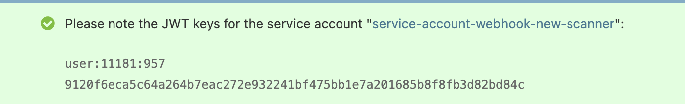

# Scanner Pipeline

The scanner pipeline is a security feature to run scanners.

## Scanner Webhooks

A scanner webhook is essentially a URL to a service subscribed to events that
occur on AMO. These webhooks are registed in the AMO (django) admin.

When a [scanner webhook event](#scanner-webhook-events) occurs, AMO will send an
HTTP request to each webhook subscribed to this event. The payload sent to the
webook depends on the event. The response from each webhook will lead to the
creation of a [scanner result](#scanner-results).

Each service registered as a scanner webhook must be protected with a shared
secret (api) key. Read [the scanners authentication
section](#scanners-authentication) for more information.

### Adding a scanner webhook

Scanner webhooks must be registered in the AMO (django) admin. The following
information must be provided:

- _Name_: the name of the scanner
- _URL_: the full URL of the scanner, which will receive the events
- _API key_: the secret key sent to the scanner to authenticate AMO requests

Add one or more scanner webhook events, see the next section for more
information.

```{note}
Upon creation, a _service account_ will be automatically generated for this
scanner webhook.

A service account is needed to authenticate the scanner against the AMO API.
Make sure to add the relevant permissions to it, depending on what the scanner
needs to access.
```

(scanner-webhook-events)=
### Scanner Webhook Events

#### `during_validation`

This event occurs when a file upload is being validated, which typically happens
when a new version is being submitted to AMO. This is called near the end of the
validation chain.

The payload sent looks like this. Assuming correct permissions, the URL in
`download_url` allows the services notified for this event to download the (raw)
uploaded file.

```json
{
  "download_url": "http://olympia.test/uploads/file/42"
}
```

#### `on_source_code_uploaded`

This event occurs when source code is uploaded, e.g., in DevHub.

The payload sent looks like this:

```json
{
  "addon_id": 85,
  "version_id": 42,
  "download_source_url": "http://olympia.test/downloads/source/42",
  "license_slug": "MPL-2.0",
  "activity_log_id": 2170
}
```

### Adding a new event

1. Add a constant for the new event in `src/olympia/constants/scanners.py`. The
   name must start with `WEBHOOK_`. Make sure the new constant is registered in
   `WEBHOOK_EVENTS` (in the same file).
2. In a `tasks.py` file, create a Celery task that calls `call_webhooks(event_name,
payload, upload=none, version=None)`. Make sure this task is assigned to a
   queue in `src/olympia/lib/settings_base.py`.
3. Invoke this Celery task (with `.delay()`) where the event occurs in the code.
4. Update this documentation page.

(scanner-results)=
## Scanner Results

A scanner result stores the output returned by a scanner, and it might be tied
to a [webhook event](#scanner-webhook-events).

Scanners can return a list of _matched rules_. When these rules exist as
[scanner rules](#scanner-rules) on AMO, it becomes possible to execute [scanner
actions](#scanner-actions). This is a core concept of the scanner pipeline,
which essentially allows a scanner to make a change to an add-on version.

(scanner-rules)=
## Scanner Rules

A scanner rule allows scanners to trigger an [action](#scanner-actions).

(scanner-actions)=
## Scanner Actions

A scanner action is some logic that can be applied to an add-on version. For
example, flagging a version for manual review is a scanner action.

These actions are defined in `src/olympia/scanners/actions.py`.

## Scanners

(scanners-authentication)=
### Authentication

Scanners must verify the incoming requests using the `Authorization` header and
not allow unauthenticated requests. For every webhook call, AMO will send this
header with the _API key_ defined in the Django admin as follows:

```
Authorization: Bearer <api_key>
```

### API response

Scanners must return a JSON response that contains the following fields:

- `version`: the scanner version

### Creating a new scanner

We provide a library to quickly develop new scanners written with Node.js:
[addons-scanner-utils][].

Start by installing the dependencies using `npm`:

```text
npm add express body-parser safe-compare addons-scanner-utils
```

Next, create an `index.js` containing the code of the scanner:

```js
import { createExpressApp } from "addons-scanner-utils";

const handler = (req, res) => {
  console.log({ data: req.body });

  res.json({ version: "1.0.0" });
};

const app = createExpressApp({
  apiKeyEnvVarName: "NEW_SCANNER_API_KEY",
})(handler);
const port = process.env.PORT || 20000;

app.listen(port, () => {
  console.log(`new-scanner is running on port ${port}`);
});
```

Start the new scanner with `node`:

```text
NEW_SCANNER_API_KEY=new-scanner-api-key node index.js
new-scanner is running on port 20000
```

Register the new scanner on AMO:


When the new scanner is created, the Django admin will display the JWT keys for
the service account bound to this new scanner. Keep these credentials safe.



When uploading a new file, you should see the following in the console:

```js
{
  data: {
    download_url: "http://olympia.test/uploads/file/fa7868396b7e44ef8a0711f608f534f7/?access_token=w0Tl7qmJqBMQ4gtitKbcdKozulWVQWhkU0wEA10N"
  }
}
```

[addons-scanner-utils]: https://github.com/mozilla/addons-scanner-utils
