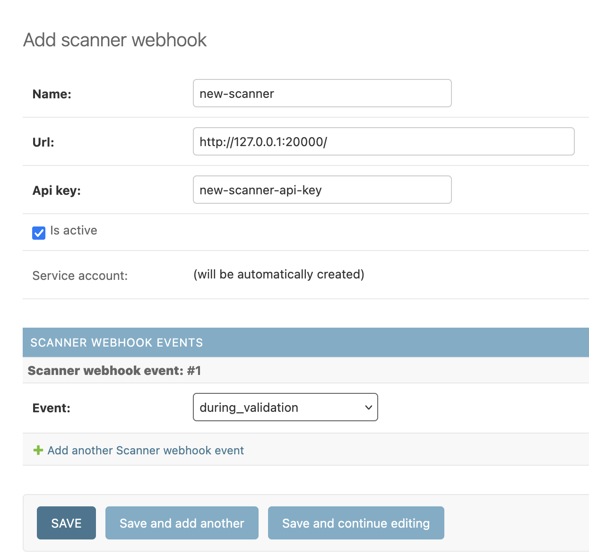
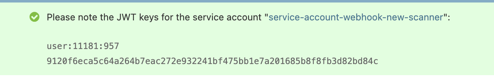

# Scanner Pipeline

The scanner pipeline is a security feature to run scanners.

## Scanner Webhooks

A scanner webhook is essentially a URL to a service subscribed to events that
occur on AMO. These webhooks are registed in the AMO (django) admin.

When a [scanner webhook event](#scanner-webhook-events) occurs, AMO will send an
HTTP request to each webhook subscribed to this event. The payload sent to the
webook depends on the event, but always includes:

- `event`: the name of the event
- `scanner_result_url`: the URL of the [scanner result](#scanner-results) that
  a scanner can use to [asynchronously send its results](#asynchronous-scanning)

Each service registered as a scanner webhook must be protected with a shared
secret (api) key. Read [the authentication section](#scanners-authentication)
for more information.

(scanners-authentication)=
### Authentication

#### Authenticating incoming webhook calls

Scanners must verify the incoming requests using the `Authorization` header and
not allow unauthenticated requests. For every webhook call, AMO will send this
header using the _API key_ defined in the Django admin as follows:

```
Authorization: HMAC-SHA256 <hexdigest>
```

`<hexdigest>` is the [HMAC-SHA256][hmac] hex digest of the request's body with
the _API key_ used as the secret key. Make sure to hash the _raw_ request's
body.

#### Authenticating asynchronous result submissions

When sending results asynchronously via PATCH to the `scanner_result_url`,
scanners must authenticate using JWT credentials. Each scanner webhook has an
automatically created service account, and the JWT keys for this account are
displayed in the Django admin after creating the webhook.

Use the JWT key and secret to generate a JWT token and include it in the
`Authorization` header when making PATCH requests to submit results
asynchronously.

### API responses

Scanners can choose to return results synchronously, asynchronously, or skip
processing the event entirely. The HTTP status code returned by the scanner
determines how AMO handles the response:

| Status code      | Meaning                                                             |
| ---------------- | ------------------------------------------------------------------- |
| `200 OK`         | Results returned synchronously in the response body                 |
| `202 Accepted`   | Scanner acknowledged the event and will send results asynchronously |
| `204 No Content` | Scanner skipped the event; no results will be stored                |

Any other status code or a response body containing an `error` field is
unsupported and/or likely to be treated as a failure.

(synchronous-response)=
#### Synchronous response

Scanners can return a JSON response immediately that contains the following fields:

- `version`: the scanner version
- `matchedRules`: an array of matched rule identifiers (string)
- `annotations` _(optional)_: a map of rule name to a list of annotation
  objects. See [Annotations](#scanner-annotations) for details.

(asynchronous-scanning)=
#### Asynchronous response

Scanners can also return a quick acknowledgment response (or any response) and
send their results later using the `scanner_result_url` provided in the webhook
payload. This is useful for long-running scans.

To send results asynchronously:

1. The scanner receives a webhook call with a `scanner_result_url` in the payload
2. The scanner returns a quick acknowledgment (e.g., HTTP 202 Accepted with body
   `{}` or `{"ok": true}`)
3. The scanner performs its analysis
4. The scanner sends a PATCH request to the `scanner_result_url` with the results

The PATCH request must be authenticated using the [service account JWT
credentials](#scanners-authentication) and include a JSON body with a `results`
field:

```json
{
  "results": {
    "version": "1.0.0",
    "matchedRules": []
  }
}
```

The `results` field should contain the same data structure as a synchronous
response would return.

#### Skipping an event

Scanners can use the `204 No Content` HTTP status code to indicate that they
intentionally skipped the event (e.g., the event is not relevant for this
scanner). No results will be stored for the scanner result associated with this
event.

(scanner-annotations)=
### Annotations

Scanners can attach human-readable annotations to matched rules by providing an
`annotations` object in the response. The `annotations` object is a map keyed
by rule name, where each value is a list of annotation objects. Each annotation
object may include a `message` (string), an optional `file` path (string),
and any other arbitrary fields.

```json
{
  "version": "1.0.0",
  "matchedRules": ["RULE_1", "ANNOTATIONS"],
  "annotations": {
    "RULE_1": [
      {
        "file": "background.js",
        "message": "Obfuscated code detected.",
        "line": 42
      },
      {
        "message": "This version contains potentially malicious code."
      }
    ],
    "ANNOTATIONS": [
      {
        "message": "This extension collects browsing history without disclosure."
      }
    ]
  }
}
```

Rules used as annotation keys must be listed in `matchedRules`. When there is
no specific rule to associate with an annotation, use `ANNOTATIONS` as the rule
name.

Each annotated rule must exist as a [scanner rule](#scanner-rules) on AMO for
the annotation to be displayed.

### Adding a scanner webhook

Scanner webhooks must be registered in the AMO (django) admin. The following
information must be provided:

- _Name_: the name of the scanner
- _URL_: the full URL of the scanner, which will receive the events
- _API key_: the secret key sent to the scanner to authenticate AMO requests

Add one or more [Scanner Webhook Events](#scanner-webhook-events).

```{note}
Upon creation, a _service account_ will be automatically generated for this
scanner webhook. The service account is automatically granted the
`Scanners:PatchResults` permission to [submit its results
asynchronously](#asynchronous-scanning).

A service account is needed to authenticate the scanner against the AMO API.
Make sure to add the relevant permissions to it, depending on what the scanner
needs to access.
```

### Creating a new scanner

We provide a library to quickly develop new scanners written with Node.js:
[addons-scanner-utils][].

Start by installing the dependencies using `npm`:

```text
npm add express safe-compare addons-scanner-utils
```

Next, create an `index.js` containing the code of the scanner:

```js
import { createExpressApp } from "addons-scanner-utils";

import pkg from "./package.json" with { type: "json" };

const handler = (req, res) => {
  console.log({ data: req.body });

  // Option 1: Synchronous response
  res.json({ version: pkg.version });

  // Option 2: Asynchronous response (for long-running scans)
  // res.status(202).json({ ok: true });
  // // Perform scanning asynchronously and later send results with:
  // //
  // // await patchScannerResult(req.body.scanner_result_url, {
  // //   results: { version: pkg.version, matchedRules: [] },
  // // });
};

const app = createExpressApp({
  apiKeyEnvVarName: "NEW_SCANNER_API_KEY",
})(handler);

const port = process.env.PORT || 20000;
app.listen(port, () => {
  console.log(`new-scanner is running on port ${port}`);
});
```

Start the new scanner with `node`:

```text
NEW_SCANNER_API_KEY=new-scanner-api-key node index.js
new-scanner is running on port 20000
```

Register the new scanner on AMO:



When the new scanner is created, the Django admin will display the JWT keys for
the service account bound to this new scanner. Keep these credentials safe.



When uploading a new file, you should see the following in the console:

```js
{
  data: {
    download_url: "http://olympia.test/uploads/file/fa7868396b7e44ef8a0711f608f534f7/?access_token=w0Tl7qmJqBMQ4gtitKbcdKozulWVQWhkU0wEA10N",
    event: "during_validation",
    scanner_result_url: "http://olympia.test/api/v5/scanner/results/123/"
  }
}
```

(scanner-webhook-events)=
## Scanner Webhook Events

### `during_validation`

```{warning}
This event is only available for legacy purposes and shouldn't be used anymore.
In most cases, `on_version_created` is a better alternative.
```

This event occurs when a file upload is being validated, which typically happens
when a new version is being submitted to AMO. This is called near the end of the
validation chain.

The payload sent looks like this. Assuming correct permissions, the URL in
`download_url` allows the services notified for this event to download the (raw)
uploaded file. The `scanner_result_url` allows the scanner to send results
asynchronously.

```json
{
  "download_url": "http://olympia.test/uploads/file/42",
  "event": "during_validation",
  "scanner_result_url": "http://olympia.test/api/v5/scanner/results/123/"
}
```

### `on_source_code_uploaded`

This event occurs when source code is uploaded, e.g., in DevHub.

The payload sent looks like this:

```json
{
  "addon": {
    "status": "public",
    "is_experimental": false,
    "description": null,
    "homepage": null,
    "icons": {
      "32": "http://olympia.test/static-server/img/addon-icons/default-32.png",
      "64": "http://olympia.test/static-server/img/addon-icons/default-64.png",
      "128": "http://olympia.test/static-server/img/addon-icons/default-128.png"
    },
    "authors": [
      {
        "id": 11181,
        "name": "Firefox user 11181",
        "url": "http://olympia.test/user/11181/",
        "username": "some-username",
        "picture_url": null
      }
    ],
    "id": 88,
    "requires_payment": false,
    "tags": [],
    "url": "http://olympia.test/api/v5/addons/addon/88/",
    "weekly_downloads": 1122,
    "ratings": {
      "average": 0.0,
      "bayesian_average": 0.0,
      "count": 0,
      "text_count": 0
    },
    "default_locale": "en-US",
    "summary": {
      "en-US": "Summary for My Extension"
    },
    "guid": "{887ea080-e5f1-4363-99d3-f90fb8594967}",
    "type": "extension",
    "categories": ["photos-music-videos"],
    "is_featured": false,
    "is_source_public": false,
    "is_disabled": false,
    "promoted": [],
    "slug": "my-extension-slug",
    "support_url": null,
    "support_email": null,
    "has_privacy_policy": false,
    "last_updated": "2026-03-03T13:03:13Z",
    "created": "2011-07-13T15:38:13Z",
    "previews": [],
    "developer_comments": null,
    "has_eula": false,
    "name": {
      "en-US": "My Extension"
    },
    "is_noindexed": false,
    "average_daily_users": 1372
  },
  "version": {
    "release_notes": null,
    "version": "12305.51787.17236.47177",
    "id": 90,
    "is_strict_compatibility_enabled": false,
    "license": {
      "id": 8,
      "is_custom": false,
      "name": {
        "en-US": "Mozilla Public License 2.0"
      },
      "slug": "MPL-2.0",
      "text": null,
      "url": "https://www.mozilla.org/MPL/2.0/"
    },
    "channel": "listed",
    "reviewed": null,
    "compatibility": {
      "firefox": {
        "min": "4.0.99",
        "max": "5.0.99"
      }
    },
    "file": {
      "id": 90,
      "created": "2026-03-03T13:03:13Z",
      "hash": "",
      "is_restart_required": false,
      "is_webextension": true,
      "is_mozilla_signed_extension": false,
      "platform": "all",
      "size": 0,
      "status": "public",
      "url": "http://olympia.test/downloads/file/90/",
      "permissions": [],
      "optional_permissions": [],
      "host_permissions": [],
      "data_collection_permissions": [],
      "optional_data_collection_permissions": []
    },
    "url": "http://olympia.test/api/v5/addons/addon/88/versions/90/",
    "download_source_url": "http://olympia.test/downloads/source/90"
  },
  "activity_log_id": 2170,
  "event": "on_source_code_uploaded",
  "scanner_result_url": "http://olympia.test/api/v5/scanner/results/124/"
}
```

```{note}
The `addon` object property is similar to the [API add-on detail
object](#addon-detail-object) but some fields differ (e.g., URL fields are API
URLs rather than website URLs, and there is no `current_version` field).

The `version` object property is also similar to the [API version detail
object](#version-detail-object).
```

### `on_version_created`

This event occurs when a new version is created.

The payload sent looks like this:

```json
{
  "addon": {
    // Similar to the `on_source_code_uploaded` event.
  },
  "version": {
    // Similar to the `on_source_code_uploaded` event.

    // `download_source_url` can be `null` when no source code was provided for
    // the version.
    "download_source_url": null
  },
  "event": "on_version_created",
  "scanner_result_url": "http://olympia.test/api/v5/scanner/results/125/"
}
```

### `push`

In addition to responding to AMO-initiated webhook events, a scanner can
proactively **push** results for an existing version using the {ref}`push
endpoint <scanner-result-push>`. This is useful for scanners that operate on
their own schedule or that re-scan versions independently of AMO events.

#### Request

Scanners can push results by sending a POST request to `/api/v5/scanner/results/`
using their JWT service account credentials. The service account must have the
`Scanners:PushResults` permission. The request body must include the version to
attach results to and the scan results:

```json
{
  "version_id": 123,
  "results": {
    "version": "1.0.0",
    "matchedRules": ["RULE_1"],
    "annotations": {}
  }
}
```

| Field        | Type    | Description                                                       |
| ------------ | ------- | ----------------------------------------------------------------- |
| `version_id` | integer | The primary key of the add-on version to attach results to        |
| `results`    | object  | Same structure as a [synchronous response](#synchronous-response) |

#### Responses

| Status code       | Meaning                                                                                        |
| ----------------- | ---------------------------------------------------------------------------------------------- |
| `201 Created`     | Result created successfully                                                                    |
| `400 Bad Request` | Validation error (unknown version, missing fields, extra fields)                               |
| `403 Forbidden`   | Not authenticated as a scanner service account, or no active webhook with a `push` event found |

### Adding a new event

1. Add a constant for the new event in `src/olympia/constants/scanners.py`. The
   name must start with `WEBHOOK_`. Make sure the new constant is registered in
   `WEBHOOK_EVENTS` (in the same file).
2. In a `tasks.py` file, create a Celery task that calls `call_webhooks(event_id,
payload, upload=none, version=None, activity_log=None)`. Make sure this task
   is assigned to a queue in `src/olympia/lib/settings_base.py`.
3. Invoke this Celery task (with `.delay()`) where the event occurs in the code.
4. Update this documentation page.

(scanner-results)=
## Scanner Results

A scanner result stores the output returned by a scanner, and it might be tied
to a [webhook event](#scanner-webhook-events).

Scanners can return a list of _matched rules_. When these rules exist as
[scanner rules](#scanner-rules) on AMO, it becomes possible to execute [scanner
actions](#scanner-actions). This is a core concept of the scanner pipeline,
which essentially allows a scanner to make a change to an add-on version.

(scanner-rules)=
## Scanner Rules

A scanner rule allows scanners to trigger an [action](#scanner-actions).

(scanner-actions)=
## Scanner Actions

A scanner action is some logic that can be applied to an add-on version. For
example, flagging a version for manual review is a scanner action.

These actions are defined in `src/olympia/scanners/actions.py`.

[addons-scanner-utils]: https://github.com/mozilla/addons-scanner-utils
[hmac]: https://en.wikipedia.org/wiki/HMAC
