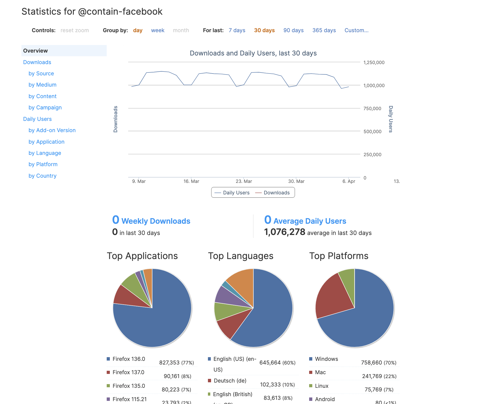

# Test Statistics Dashboard

Test the devhub statistics dashboard locally with bigquery credentials.

## Steps

### Setup bigquery credentials

[Bigquery Credentials Setup](./bigquery_credentials_setup.md)

### Enable a local addon to read from bigquery dev database

Only a [subset of addons][enabled_dev_guids] in dev push data to bigquery. In order to read from bigquery your local addon will need to use a matching `guid`.

Open a django shell `make djshell` and run the following:

- pk: the database id of the addon you want to use
- guid: the guid from the [list][enabled_dev_guids] you want to use (e.g. `@contain-facebook`)

```python
addon = Addon.objects.get(pk=<pk>)
addon.update(guid=<guid>)
addon.addonguid.guid = <guid>
addon.addonguid.save()  # Need to trigger post-save to update hashed_guid.
```

### Run the statistics dashboard

Open your addon `<http://olympia.test/en-US/firefox/addon/<pk>/statistics/>`

You should see the default overview chart. It should look like this:



[enabled_dev_guids]: https://github.com/mozilla/bigquery-etl/blob/main/sql/moz-fx-data-shared-prod/amo_dev/amo_stats_dau_v2/query.sql
