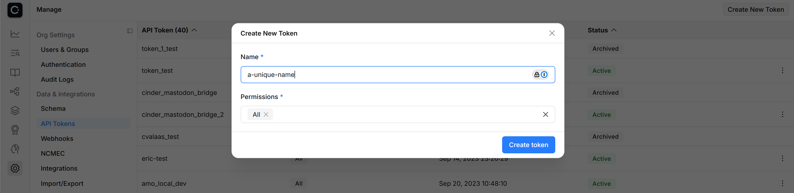
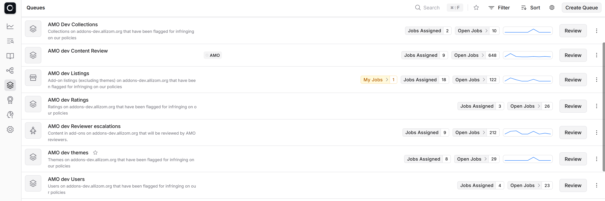
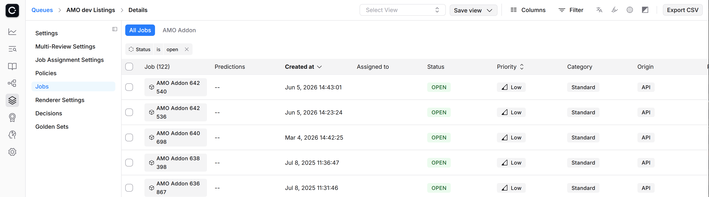
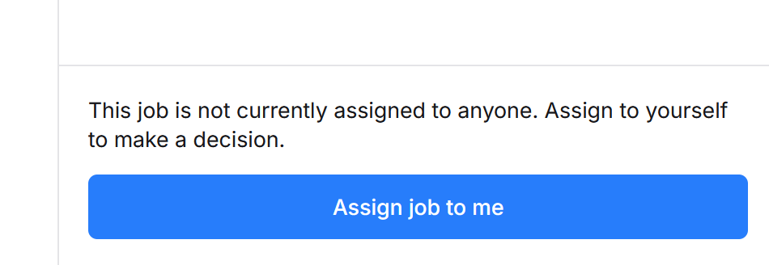
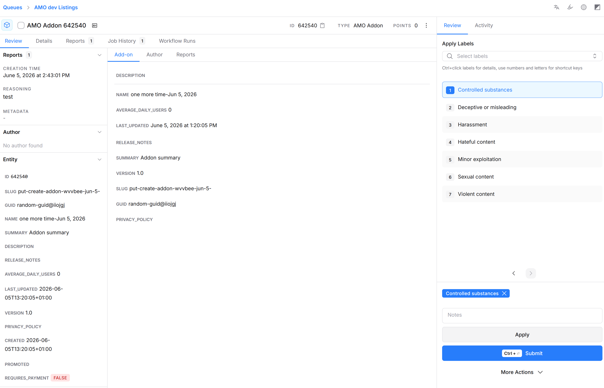
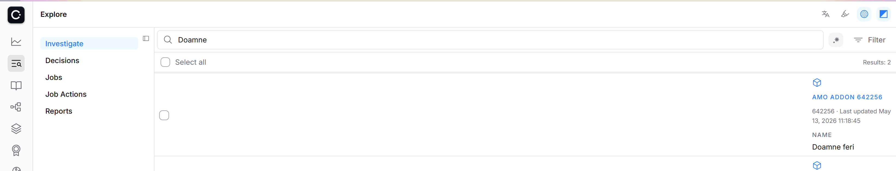
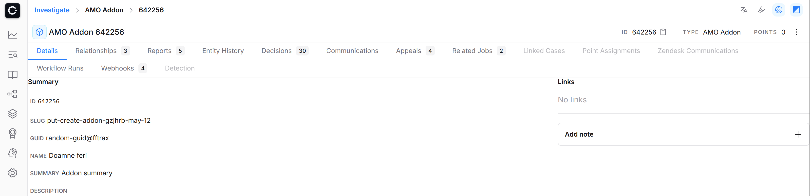
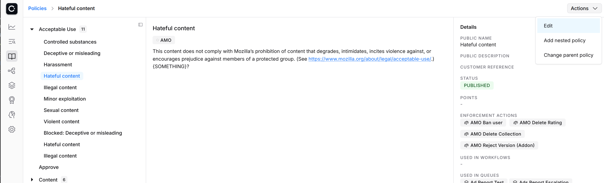
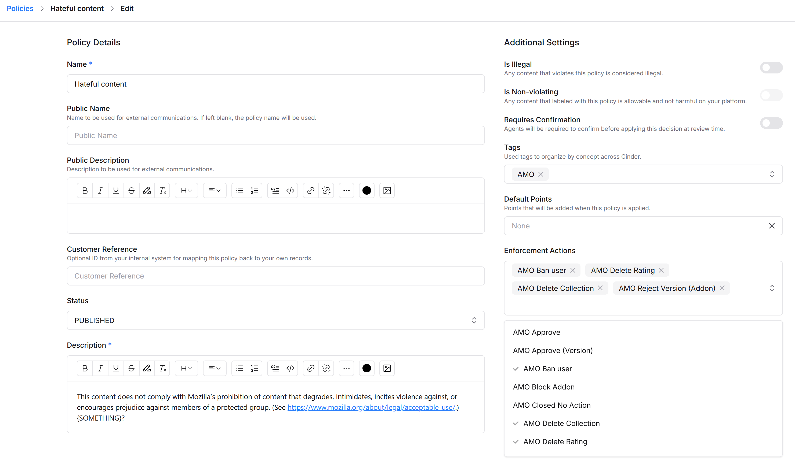
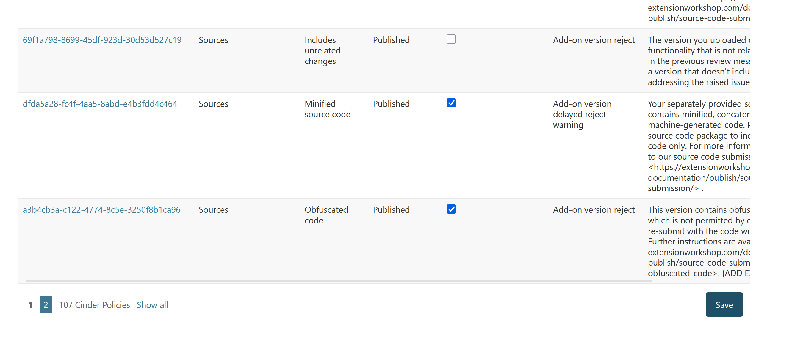

# Cinder

Cinder is a content moderation tool that AMO uses to track abuse reports, decisions on content (both on the back of abuse reports, and proactively), and appeals for our decisions.  The Cinder tooling on their website is used by a moderation team managed by Trust & Safety (T&S), and by Mozilla Legal. The tooling is not routinely used by AMO reviewers and Operations (who have their own dedicated reviewer and Django admin tools), but AMO submits to, and relies on, Cinder for all* decisions, regardless of the tool's location.


```{note}
* There is still some work ongoing to create decisions for all actions made in Django admin.
```

## Nomenclature

- Content: content is the things that can be reported for abuse on AMO: add-ons, ratings, collections, and users. They are represented as entities.
- Entity: Entities that AMO uses in Cinder are
  - `amo-addon` add-ons, meaning extensions or themes
  - `amo-rating` user ratings/reviews for add-ons
  - `amo-collection` user-created collections of add-ons
  - `amo-user` user accounts that can own add-ons, ratings, or collections
  - `amo-content-change` a helper entity, created to store some extra metadata for content review
  - `amo-report` a helper entity, created to store some extra metadata for an abuse report
  - `amo-unauthenticated-reporter` an entity created when an abuse report is submitted without being logged in, but with an email/name. (Authenticated users would use `amo-user`.)
- Report: abuse reports, submitted by users. When reported to AMO they are bundled into jobs by Cinder.
- Job: these are either created with an abuse report, bundled into open jobs by subsequent abuse reports, created by automated events, or created manually.
- Decision: decisions are either made on jobs (which close the job), or without a job, on an entity directly.
- Appeal: some decisions can be appealed by the affected parties (e.g. add-on owner, abuse reporter, etc.). The appeal creates an appeal job.
- Policy: a decision has one or more policies attached to it, to represent what offenses took place. (Or not, in the case of non-offending policies, e.g. Approve). Each policy has one or more enforcement actions attached to it.
- (Enforcement) Action: something that should happen to an entity, based on a decision.
- Queue: jobs are created in queues. When an abuse report is submitted, it is reported to a queue. They are generally split per entity (though that is not a requirement - some queues, such as T&S Escalations, contain jobs of different types of entities).


## Environments and access

Access to all Cinder environments relies on Mozilla LDAP, so is generally limited to Mozilla staff/contractors.

### Cinder staging

<https://mozilla-staging.cinderapp.com/>

Cinder staging is used for all non-production integration, QA, and testing.  Both <https://addons-dev.allizom.org> and <https://addons.allizom.org/> integrate to the same staging instance, as would any local testing/integration.

#### Access

Ask in #cinder-xfn on Slack for access. You will need to be added to the <https://people.mozilla.org/a/cinder_stage_access/> group. Once you have access you may also need to be added to some access groups in <https://mozilla-staging.cinderapp.com/settings/users>.

### Cinder production

<https://mozilla.cinderapp.com/>

Cinder production is used for production AMO only - <https://addons.mozilla.org> - so it contains live, sensitive, and privileged data. It should not be used for testing - actions taken there will have immediate consequences on production AMO.

#### Access

If you have a need for access, ask in #cinder-xfn on Slack. You will need to be added to the <https://people.mozilla.org/a/cinder_production_access/> group. Once you have access you may also need to be added to some access groups in <https://mozilla.cinderapp.com/settings/users>.


(api_key)=
## API keys

Generate an API key for your local environment <https://mozilla-staging.cinderapp.com/settings/general> - for local integration/testing you generally need All permissions



Put the token displayed when you create the token in your ./local_settings.py file as:

```python
CINDER_API_TOKEN = '<token-here>'
```


## Webhook integration/payload

AMO dev, stage, and production all have webhooks defined at <https://mozilla-staging.cinderapp.com/settings/webhooks/configuration> (and similarly for production), which send JSON payloads on actions taken in Cinder.  You don't generally need to create these for local development. You would need a permanent, internet-accessible webhook URL, for a start. Instead, we replay the payloads sent to AMO locally.

All webhook payloads are displayed in <https://mozilla-staging.cinderapp.com/settings/webhooks/activity>.  Clicking "show payload/response" exposes the JSON - you can copy it with the copy icon on the right-hand side.

Locally, the webhook payload can be copied to a local .json file and consumed, skipping authentication, with `./manage.py fake_cinder_webhook`.  The default location for the payload file is `./tmp/payload.json`.


## Useful waffle switches to enable

- `manage.py waffle_switch dsa-job-technical-processing on` to create cinder jobs for abuse reports
- `manage.py waffle_switch dsa-abuse-reports-review on` to flag add-ons for review in our reviewer tools queue when they are reported for specific reasons and locations
- `manage.py waffle_switch dsa-cinder-forwarded-review on` to flag add-ons for review in our reviewer tools queue when a job is forwarded from Cinder (after you've replayed the webhook)


## Cinder queues

`Cinder queues <https://mozilla-staging.cinderapp.com/queues>` are lists of jobs.  Generally you will be only interested in open jobs (the view can be filtered).





## Making a decision on a job

Once you're on the page for a job, to make a decision on it you must first assign yourself to the job.



Then choose policies that should be applied to the decision on the job and press Submit




## Investigate/entity pages

<https://mozilla-staging.cinderapp.com/explore/investigate> allows you to search for any entity (Add-on, collection, user, rating).  You can filter by entity type if you know what it is you're searching for.




Furthermore, if you know the entity type and id you can directly go to the entity's page, for example: <https://mozilla-staging.cinderapp.com/investigate/amo_addon/642256/> is the entity page for the add-on with the id 642256.

The investigate page has tabs with links to past decisions, jobs, etc.  The right hand side kebab menu allows manual actions for the entity, which creates a decision with an enforcement action; apply policy, which creates a decision with policies (that themselves have enforcement actions); or send the entity to a queue.





## Cinder policies

<https://mozilla-staging.cinderapp.com/policies>

AMO's acceptable use policies are defined in Cinder - both the text that will be exposed to end-users in emails, and the enforcement action that should take place if content breaches our policies. Policies on production Cinder are managed by T&S and AMO Operations and should not be changed; policies on staging Cinder may be changed as necessary for testing/QA.




### Editing a policy

Typically we might want to change the enforcement actions to test a new feature.



Remember to sync Cinder policies in your local AMO afterwards to get the changes.


## Syncing Cinder policies to AMO

Policies should be synced from Cinder to enable consistent enforcement actions to be applied, and up-to-date policy text to be sent/shown to end-users.

After you've set your {ref}`API key <api_key>` locally, you can synchronise the policies from Cinder to your local database with `./manage.py sync_cinder_policies`. (Or there is a button in `Django admin <http://olympia.test/admin/models/abuse/cinderpolicy/>`.)


## Enabling policies in the reviewer tools

After syncing, all policies should be available in AMO, but will not automatically be exposed in AMO reviewer tools. You probably want to filter to only "Published" policies.

To make policies available you can use `Django admin <http://olympia.test/admin/models/abuse/cinderpolicy/>` to toggle the "Expose in reviewer tools" checkbox (if you use the checkboxes on the list page, you have to press Save at the end of the list to commit the changes).


